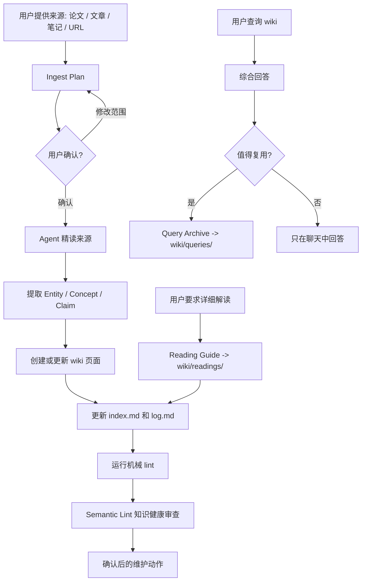

<div align="center">

# LLM Wiki Toolchain

**用 AI agent 在 Obsidian 中构建、查询、审查和维护 Karpathy 风格的 LLM Wiki。**

[English](./docs/README.en.md) · [安装](#安装) · [快速开始](#快速开始) · [工作流](#工作流) · [项目结构](#项目结构)


</div>

---

`llm-wiki-toolchain` 是一个 agent skill, 用来把“读论文 / 文章 / 笔记 → 详细解读 → 提取知识 → 交叉引用 → 持续维护”的过程沉淀成可演进的 Obsidian wiki。

它基于 [Karpathy 的 LLM Wiki 模式](https://x.com/karpathy/status/1881417542127472796), 但更强调可验证的工作流: 写入前先计划, 查询后可归档, 机械 lint 和 Semantic Lint 知识健康审查分层运行。

## 为什么用它

| 你想要 | Toolchain 提供 |
|---|---|
| 摄入论文、文章、URL、本地笔记 | Ingest Plan 先审阅来源身份、页面影响、重复和漂移风险 |
| 想顺着论文逻辑读懂全文 | Reading Guide 将详细解读保存到 `wiki/readings/`，并默认做可读性润色 |
| 让 wiki 能回答问题 | Agent 先读 `index.md` 和相关页面, 再用 wikilink 引用回答 |
| 把好问题留下来 | Query Archive 将可复用答案保存到 `wiki/queries/` |
| 避免 wiki 变乱 | `lint.py` 检查孤页、断链、索引、raw hash、tag、stale、log、topic-map |
| 发现知识层面的坏味道 | Semantic Lint 知识健康审查输出矛盾、缺失、弱证据等结构化待确认项 |
| 保留历史而不是误删 | `_archive/` 归档过时、重复、被替代页面 |

## 工作流



## 核心能力

| 能力 | 说明 | 主要产物 |
|---|---|---|
| 摄入 | 单来源精读和批量来源导入, 自动建立交叉引用 | `raw/`, `wiki/`, `index.md`, `log.md` |
| 写入前计划 | 先输出 Ingest Plan, 再等待用户确认 | chat report / optional JSON |
| 详细解读 | 为论文、长文章、报告保存讲解稿式 Reading Guide | `wiki/readings/*.md` |
| 可读性标准 | 让 wiki 页面更像给未来的自己写的解释，同时保护 raw evidence | Readable Wiki Page pass |
| 查询 | 综合 wiki 页面回答问题, 保留依据页面 | wikilink 引用 |
| Query Archive | 将可复用答案归档为一等知识条目 | `wiki/queries/*.md` |
| 自动 lint | 13 项机械健康检查 | terminal report / JSON |
| Semantic Lint | LLM-assisted 知识健康审查, 输出待确认 findings | chat report |
| 播种 | 在摄入来源前搭建知识骨架 | seeded wiki structure |
| 归档 | 过时页面移入 `_archive/`, 保留历史 | archived pages |

## 安装

### npx skills

```bash
npx skills add https://github.com/mixgreen/llm-wiki-toolchain
```

支持 Claude Code、Gemini CLI、Codex CLI 等主流 agent, 安装器会自动检测并写入 loader note。

### Claude Code plugin

在 `~/.claude/settings.json` 的 `extraKnownMarketplaces` 中添加:

```json
{
  "extraKnownMarketplaces": {
    "llm-wiki-toolchain": {
      "source": {
        "source": "github",
        "repo": "mixgreen/llm-wiki-toolchain"
      }
    }
  }
}
```

然后在 Claude Code 中运行:

```text
/install llm-wiki-toolchain
```

### 其他安装方式

<details>
<summary>curl 一键安装</summary>

```bash
curl -fsSL https://raw.githubusercontent.com/mixgreen/llm-wiki-toolchain/main/install.sh | bash
```

交互式选择要安装到哪些 agent: Gemini CLI、Codex CLI、OpenClaw、Hermes。

</details>

<details>
<summary>手动安装</summary>

```bash
git clone https://github.com/mixgreen/llm-wiki-toolchain.git
```

将 `skills/llm-wiki-toolchain/` 目录复制到目标 agent 的 skill 路径, 然后在指令文件中添加 loader note。

</details>

## 支持的 Agent

| Agent | 安装路径 | 指令文件 |
|---|---|---|
| Claude Code | `~/.claude/skills/llm-wiki-toolchain/` | `CLAUDE.md` |
| Gemini CLI | `~/.gemini/skills/llm-wiki-toolchain/` | `GEMINI.md` |
| Codex CLI | `~/.codex/skills/llm-wiki-toolchain/` | `AGENTS.md` |
| OpenClaw | `~/.openclaw/skills/llm-wiki-toolchain/` | `OPENCLAW.md` |
| Hermes Agent | `~/.hermes/skills/note-taking/llm-wiki-toolchain/` | 自动发现 |

## 快速开始

### 1. 初始化 wiki

```bash
python3 <安装路径>/scripts/init.py ~/Documents/MyVault "量子计算" --topic "量子计算与量子纠错"
```

生成结构:

```text
量子计算/
├── raw/                  # 不可变原始文档
├── wiki/
│   ├── entities/         # 人物、组织、产品
│   ├── concepts/         # 理论、框架、方法
│   ├── topics/           # 来源摘要、领域概览
│   ├── comparisons/      # 横向对比分析
│   ├── readings/         # 详细解读、论文导读
│   └── queries/          # 值得留存的查询结果
├── _archive/             # 归档页面
├── _meta/topic-map.md    # 主题导航图
├── index.md              # 全量索引
├── log.md                # 活动日志
└── SCHEMA.md             # 约定与规范
```

### 2. 写入前先生成 Ingest Plan

```bash
python3 <安装路径>/scripts/ingest_plan.py ~/Documents/MyVault/量子计算 ./paper-notes.md
python3 <安装路径>/scripts/ingest_plan.py ~/Documents/MyVault/量子计算 ./paper-notes.md --json
```

该命令只输出报告, 不会写入 `raw/`、`wiki/`、`index.md` 或 `log.md`。确认计划后, 再让 agent 执行正式摄入。

### 3. 运行机械 lint

```bash
python3 <安装路径>/scripts/lint.py ~/Documents/MyVault/量子计算

# 常用选项
python3 ... --json              # JSON 输出
python3 ... --orphans           # 仅检查孤页
python3 ... --tags              # 标签审计
python3 ... --stale             # 过时页面, 默认 >90 天未更新
python3 ... --pages "a.md,b.md" # 只检查指定页面
```

### 4. 在 agent 会话中使用

```text
帮我摄入这篇论文到 wiki
先给我这篇论文的 Ingest Plan
帮我详细解读一下这篇论文
wiki 里关于 XX 的内容有哪些?
把这个回答归档成 Query Archive
跑一下 lint 看看 wiki 健康状况
对最近改过的页面做一次 Semantic Lint
帮我搭建一个关于 YY 的知识骨架
```

Agent 会加载 `SKILL.md` 中的完整工作流指令。

## Agent 配置

安装器会写入类似下面的 loader note:

```markdown
## Agent skills — LLM Wiki Toolchain

When working with Obsidian LLM Wiki knowledge bases, load and follow:
`<安装路径>/SKILL.md`.

Resolve linked files relative to that directory:
- scripts/init.py
- scripts/lint.py
- scripts/ingest_plan.py
- templates/
- references/
```

## 项目结构

```text
├── .claude-plugin/plugin.json    # Claude Code plugin 清单
├── skills/llm-wiki-toolchain/
│   ├── SKILL.md                  # 完整工作流文档
│   ├── scripts/
│   │   ├── init.py               # Wiki 初始化
│   │   ├── ingest_plan.py        # 写入前摄入计划报告
│   │   └── lint.py               # 自动化健康检查
│   ├── templates/                # 页面和结构模板
│   │   └── page-templates/       # entity / concept / topic / comparison / reading / query
│   └── references/               # 设计决策、模式参考、踩坑记录
├── install.sh                    # 交互式安装脚本
└── README.md
```

## 更新

```bash
# git clone 安装
cd <安装路径> && git pull

# curl / npx 安装
重新运行安装器即可
```

## 许可证

MIT
