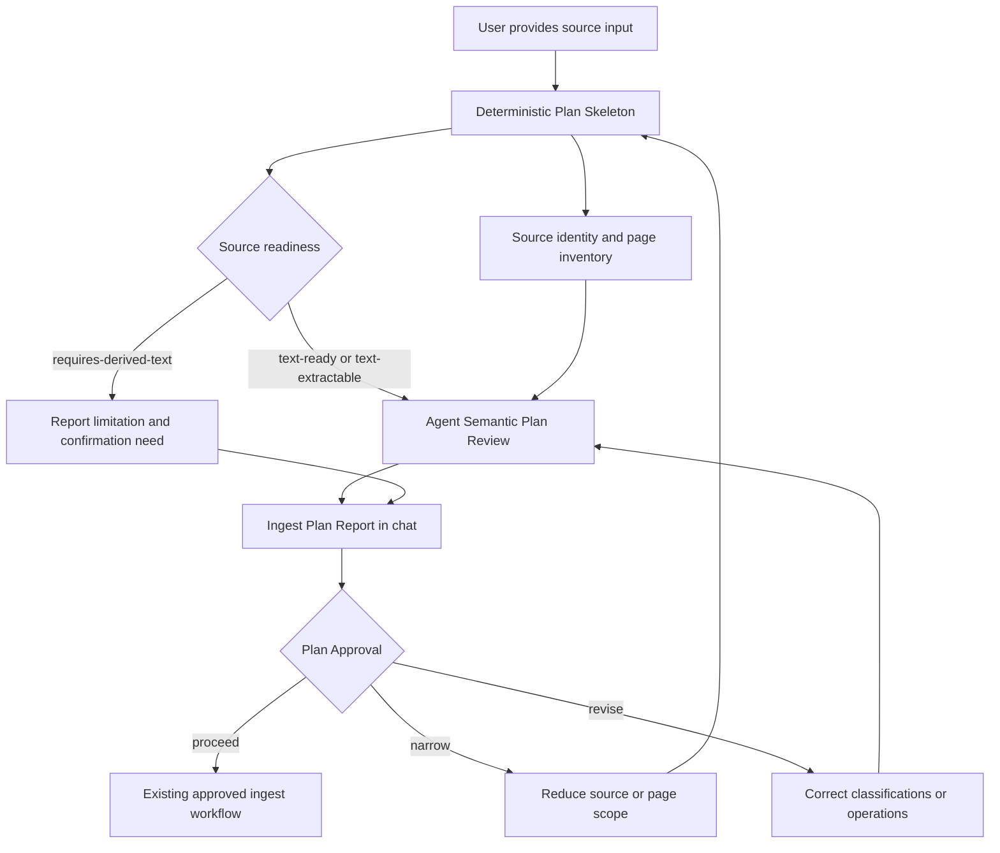

# feat: Add Ingest Plan workflow

## Summary

Add a pre-write `Ingest Plan` workflow that lets a user review source-to-wiki impact before any raw or wiki files are modified. The first implementation should combine a deterministic file/page-level skeleton with agent-authored semantic review, keeping single-source review fast and batch review visibly overload-prone.

---

## Problem Frame

The current ingest workflow is documented in `skills/llm-wiki-toolchain/SKILL.md`, but important safety checks depend on the agent remembering and following prose instructions. This plan turns the riskiest pre-write checks into a repeatable planning surface so duplicate pages, ambiguous page matches, source drift, and batch overload are visible before approved ingest begins.

---

## Requirements

**Plan Boundary**

- R1. The Ingest Plan must not create, update, archive, or delete raw or wiki files.
- R2. The default output must be a chat-readable Markdown report, with JSON available for tests and automation.
- R3. The workflow must require explicit Plan Approval before any subsequent ingest write.

**Source Review**

- R4. The plan must support raw files, external local files, URLs, and pasted content.
- R5. The plan must classify source readiness as `text-ready`, `text-extractable`, or `requires-derived-text`.
- R6. Source identity must treat matching `sha256` as the same source, matching URL plus different hash as Source Drift, and similar filenames as weak duplicate hints only.
- R7. External sources may receive a proposed Raw Destination, but the plan must not write that destination.

**Knowledge Review**

- R8. Candidate Knowledge Items must be classified as Entity, Concept, or Claim.
- R9. Entity and Concept candidates must include a reason; Claim candidates must include a source excerpt or locator.
- R10. Page Operations must be limited to `create`, `update`, `merge`, `skip`, and `needs-confirmation`.
- R11. Existing Page Match must be conservative: exact page stem, exact wikilink, or explicit alias only.
- R12. Source Summary Page impact must be planned separately from Entity, Concept, and Claim candidates.

**Review Ergonomics**

- R13. Single-source plans must be source-first and comfortable to review in one to two screens for ordinary sources.
- R14. Batch plans must warn when they cover more than five sources or more than ten impacted wiki pages.
- R15. Ingest Plan v1 must explain Source-to-Wiki Impact only; it must not perform cross-source synthesis.
- R16. Research paper plans must include a lightweight Paper Lens: research question, method, main contribution, limitations, and follow-up value.

---

## Scope Boundaries

### In Scope

- New deterministic skeleton script for source/page scanning.
- Agent workflow updates that define how to complete the semantic portion of the report.
- Markdown and JSON report shapes for the same plan data.
- Fixture-based tests covering source identity, overload detection, conservative matching, and report rendering.
- README and skill documentation updates so users know the plan is the default pre-write gate.

### Deferred to Follow-Up Work

- Alias extraction or alias registry improvements beyond consuming explicit aliases if already present.
- Rich text extraction for PDF, docx, URLs, images, video, or presentations.
- A separate semantic-lint workflow for contradictions and missing concepts.

### Out of Scope

- Saved Ingest Plan artifacts under the wiki.
- Automatic wiki writes during plan creation.
- Cross-source synthesis or literature review.
- Embedding search, paragraph chunking, reranking, or RAG infrastructure.
- Archive as an Ingest Plan Page Operation.

---

## Key Technical Decisions

- KTD1. New script instead of extending `lint.py`: `lint.py` checks existing wiki health, while Ingest Plan builds a pre-write review surface. Keeping them separate preserves the mental model and avoids mixing validation output with planning output.
- KTD2. Deterministic skeleton owns file/page facts only: the script should compute hashes, source identity, readiness, raw destination suggestions, page inventory, index links, conservative matches, and overload flags. Agent-authored Semantic Plan Review should own Entity, Concept, and Claim extraction.
- KTD3. Markdown first, JSON second: Markdown is the user-facing report because the human is the primary reviewer. JSON mirrors the same data for tests and future automation.
- KTD4. Conservative matching by default: exact stem, exact wikilink, and explicit alias are the only automatic update matches. Any fuzzy, translated, spacing-different, or title-similar candidate becomes `needs-confirmation`.
- KTD5. Documentation changes carry the mandatory-gate behavior: `SKILL.md` and `SCHEMA.md` should make Ingest Plan the default path for papers, articles, PDFs, URLs, and batch sources while preserving the Tiny Note Exception.

---

## High-Level Technical Design

The deterministic script produces facts and placeholders that are safe to compute without semantic judgment. The agent then fills the interpretive layer in chat, and no write path opens until the user approves the report.

---

## Implementation Units

### U1. Add deterministic Ingest Plan skeleton script

- **Goal:** Create the script entry point that gathers source and wiki facts without modifying the wiki.
- **Requirements:** R1, R4, R5, R6, R7, R11, R14
- **Dependencies:** None
- **Files:**
  - `skills/llm-wiki-toolchain/scripts/ingest_plan.py`
  - `tests/test_ingest_plan.py`
  - `tests/fixtures/ingest_plan_basic/`
- **Approach:** Follow the CLI style of `skills/llm-wiki-toolchain/scripts/lint.py`: argparse entry point, JSON-compatible result dictionary, Markdown formatter, exit code `0` for successful plan generation and `2` for hard input errors. The script should accept a wiki root and one or more source inputs, compute body hashes where possible, infer readiness and source type, inspect `raw/`, `wiki/**.md`, and `index.md`, and return source/page-level skeleton data.
- **Patterns to follow:** Reuse the frontmatter parsing, wikilink extraction, unique page inventory, and report formatting style from `skills/llm-wiki-toolchain/scripts/lint.py`.
- **Test scenarios:**
  - Given a text source outside `raw/`, when the script runs, it reports `text-ready`, a computed `sha256`, and a proposed Raw Destination without writing the file.
  - Given a raw file with matching body hash, when the script runs, it reports the source as already present.
  - Given a raw file with the same `source_url` and different hash, when the script runs, it reports Source Drift and marks confirmation as required.
  - Given six source inputs, when the script runs, it reports the review as overload-prone even if page impact is small.
  - Given an unreadable or missing source path, when the script runs, it exits with an input error and does not produce a partial success result.
- **Verification:** The script can be invoked on fixture wikis and returns deterministic Markdown and JSON without changing fixture contents.

### U2. Model conservative page matching and page impact

- **Goal:** Add page-impact skeleton data that distinguishes exact updates from confirmation-needed matches.
- **Requirements:** R10, R11, R12, R13, R14
- **Dependencies:** U1
- **Files:**
  - `skills/llm-wiki-toolchain/scripts/ingest_plan.py`
  - `tests/test_ingest_plan.py`
  - `tests/fixtures/ingest_plan_matching/`
- **Approach:** Build page inventory from current wiki pages and index wikilinks. Treat exact page stem and exact wikilink as update-capable matches. Treat case, spacing, translation, and filename-similar candidates as possible matches that require confirmation. Include a source-level placeholder for Source Summary Page impact separately from candidate page operations.
- **Patterns to follow:** Use `find_wiki_pages`, `extract_wikilinks`, and exact-match-first logic from `lint.py`, but avoid its lowercase fallback becoming an automatic update decision.
- **Test scenarios:**
  - Given candidate title `Agent沙盒安全模型` and existing page `Agent沙盒安全模型.md`, when matching runs, it classifies the page as an exact update candidate.
  - Given candidate title `Agent 沙盒安全模型` and existing page `Agent沙盒安全模型.md`, when matching runs, it classifies the match as needs-confirmation.
  - Given an index wikilink that exactly matches a page, when matching runs, it recognizes the existing page as update-capable.
  - Given two near-duplicate existing pages, when matching runs, it proposes `merge` only as a plan operation and does not archive either page.
  - Given a source that will create a Source Summary Page, when output renders, that source-level impact is listed separately from Entity, Concept, and Claim candidates.
- **Verification:** Matching output is conservative, stable across runs, and never classifies fuzzy matches as automatic updates.

### U3. Render Markdown and JSON Ingest Plan Reports

- **Goal:** Produce the user-facing report shape and machine-readable mirror required by the workflow.
- **Requirements:** R2, R8, R9, R10, R13, R16
- **Dependencies:** U1, U2
- **Files:**
  - `skills/llm-wiki-toolchain/scripts/ingest_plan.py`
  - `tests/test_ingest_plan.py`
  - `tests/fixtures/ingest_plan_reports/`
- **Approach:** Render the canonical sections from the requirements document: Source Summary, Candidate Knowledge Items, Page Impact, Risks and Confirmations, Recommended Next Step, and optional Machine Data. The script should render placeholders for Semantic Plan Review fields that require agent interpretation, while JSON mode exposes the same structure for automated checks.
- **Patterns to follow:** Mirror `lint.py`'s `--json` option and human-readable Markdown report approach.
- **Test scenarios:**
  - Given a normal single-source fixture, when Markdown renders, sections appear in canonical order and source-first shape.
  - Given an overload-prone batch fixture, when Markdown renders, the Recommended Next Step prefers narrowing.
  - Given JSON mode, when output is parsed, it contains source summaries, page impact entries, risks, and semantic-review placeholders.
  - Given a research-paper source type, when Markdown renders, Paper Lens placeholders appear.
  - Given a Claim placeholder without excerpt or locator in test data, when validation runs, it marks the claim incomplete rather than silently accepting it.
- **Verification:** Markdown is concise enough for chat use, and JSON round-trips through tests without relying on presentation text.

### U4. Update agent workflow documentation and templates

- **Goal:** Make Ingest Plan the documented default pre-write gate for meaningful ingest work.
- **Requirements:** R1, R3, R4, R8, R9, R10, R12, R15, R16
- **Dependencies:** U1, U2, U3
- **Files:**
  - `skills/llm-wiki-toolchain/SKILL.md`
  - `skills/llm-wiki-toolchain/templates/SCHEMA.md`
  - `skills/llm-wiki-toolchain/references/ingest-plan-workflow.md`
  - `tests/test_ingest_plan.py`
- **Approach:** Add a focused reference document for the workflow and point `SKILL.md` to it from the ingest section. Update `SCHEMA.md` so initialized wikis inherit the Plan Approval rule, Tiny Note Exception, Source Identity rules, and Source-to-Wiki Impact v1 boundary. Keep the main skill readable by moving detailed report-field rules into the reference.
- **Patterns to follow:** Existing reference files under `skills/llm-wiki-toolchain/references/` hold detailed operational patterns while `SKILL.md` remains the daily entry point.
- **Test scenarios:**
  - Given generated documentation, when searched for Ingest Plan, the main skill describes it as the default gate before meaningful ingest writes.
  - Given generated documentation, when searched for Tiny Note Exception, papers, articles, PDFs, URLs, and batch sources are excluded from the exception.
  - Given `SCHEMA.md`, when a new wiki is initialized, the seeded schema includes Ingest Plan language.
  - Given the reference document, when reviewed, it uses the canonical Page Operation set and does not include `archive` as an operation.
- **Verification:** A user reading the skill can tell when to run an Ingest Plan, what the agent must complete semantically, and when writes are allowed.

### U5. Add test fixtures and validation entry points

- **Goal:** Make the new workflow verifiable without requiring a real Obsidian vault.
- **Requirements:** R1, R2, R6, R11, R14
- **Dependencies:** U1, U2, U3
- **Files:**
  - `tests/test_ingest_plan.py`
  - `tests/fixtures/ingest_plan_basic/`
  - `tests/fixtures/ingest_plan_matching/`
  - `tests/fixtures/ingest_plan_reports/`
  - `README.md`
  - `docs/README.en.md`
  - `package.json`
- **Approach:** Use Python's standard `unittest` or another no-extra-dependency test harness so the repository stays easy to run. Add README examples showing the plan command, JSON mode, and the fact that the command does not write wiki files. Add a package-level validation script only if it does not introduce dependency churn.
- **Patterns to follow:** The repository currently uses plain Python scripts and no project-level Python dependency manager, so tests should avoid requiring `pytest` unless the implementation intentionally introduces it.
- **Test scenarios:**
  - Given fixture directories, when the test suite runs, source identity, matching, overload detection, Markdown rendering, and JSON rendering are covered.
  - Given plan generation tests, when fixture files are hashed before and after, fixture contents are unchanged.
  - Given README examples, when checked manually, they use repo-relative skill paths and do not imply automatic ingest writes.
  - Given package validation metadata, when installed by a user, existing `npx` and installer flows remain unchanged.
- **Verification:** Contributors can validate the new workflow locally with the repository's documented test entry point, and users can discover the new command from both Chinese and English READMEs.

---

## Acceptance Examples

- AE1. Given a single paper PDF path, when an agent creates an Ingest Plan, then the report shows source readiness, source identity, proposed raw destination, Paper Lens placeholders, source summary impact, candidate page operations, risks, and a Plan Approval prompt.
- AE2. Given a source URL already present in raw with a different hash, when an Ingest Plan is generated, then the report marks Source Drift and recommends confirmation instead of update.
- AE3. Given batch input with six sources, when an Ingest Plan is generated, then the report marks the review overload-prone and recommends narrowing.
- AE4. Given a candidate whose title differs from an existing Chinese page only by spacing, when page matching runs, then the operation is `needs-confirmation`, not `update`.
- AE5. Given a Tiny Note Exception request, when the user explicitly asks for direct capture of a small pasted note, then the agent may bypass full Ingest Plan; papers, URLs, PDFs, and batch sources cannot use this exception.

---

## Risks and Dependencies

- **Semantic overreach:** The agent may treat script placeholders as final semantic judgments. Mitigation: docs must clearly distinguish Deterministic Plan Skeleton from Semantic Plan Review.
- **Report bloat:** The Markdown report can become too long, especially for batch sources. Mitigation: source-first single-source reports stay concise, and overload-prone batch reports recommend narrowing.
- **False confidence on non-text sources:** PDFs, images, videos, and presentations may not be fully readable. Mitigation: Source Readiness must surface `requires-derived-text` rather than pretending the source was understood.
- **Alias ambiguity:** Conservative matching needs explicit aliases, but existing templates do not define a full alias model. Mitigation: v1 only consumes explicit aliases if present and sends unclear matches to confirmation.

---

## Documentation Plan

- Update `skills/llm-wiki-toolchain/SKILL.md` so the ingest section routes meaningful sources through Ingest Plan before writing.
- Update `skills/llm-wiki-toolchain/templates/SCHEMA.md` so new wikis inherit the workflow boundary.
- Add `skills/llm-wiki-toolchain/references/ingest-plan-workflow.md` for detailed report anatomy and agent responsibilities.
- Update `README.md` and `docs/README.en.md` with a short example and the no-write guarantee.

---

## Sources and Research

- Origin requirements: `docs/brainstorms/2026-06-11-ingest-plan-requirements.md`
- Canonical vocabulary: `CONTEXT.md`
- Existing ingest workflow: `skills/llm-wiki-toolchain/SKILL.md`
- Existing lint/report patterns: `skills/llm-wiki-toolchain/scripts/lint.py`
- Wiki initialization pattern: `skills/llm-wiki-toolchain/scripts/init.py`
- Template conventions: `skills/llm-wiki-toolchain/templates/SCHEMA.md`

