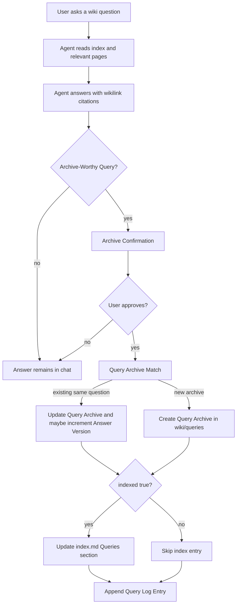

# feat: Strengthen Query Archive workflow

## Summary

Promote Query Archive from a brief optional prompt into a first-class wiki workflow. The implementation should update the skill instructions, seeded schema, page templates, index/log conventions, and lightweight validation so reusable answers can reliably feed the wiki back through `wiki/queries/`.

---

## Problem Frame

The repository already has a `wiki/queries/` directory, a query page template, and schema language for query pages, but the main query workflow still says only to ask whether a valuable answer should be archived and suggests writing to `wiki/topics/` or `wiki/concepts/`. That leaves the strongest Karpathy-style behavior underspecified: good questions should become durable wiki entries with provenance, answer versioning, follow-up actions, and index/log visibility.

---

## Requirements

**Archive Trigger and Boundary**

- R1. The query workflow must define Archive-Worthy Query criteria that trigger an archive offer without asking for every trivial query.
- R2. Query Archive must default to `wiki/queries/`; conversion to concepts, entities, comparisons, or topics must be explicit.
- R3. Query Archive V1 must not add a new script, a separate Query Plan artifact, automatic Basis Page edits, or raw copies of chat answers.
- R4. Archive Confirmation must summarize title, destination, index status, Answer Version, Basis Pages, Raw Evidence readiness, Follow-Up Actions, status, and confidence before writing.

**Archive Content**

- R5. Query Archive pages must preserve the Original Question, Canonical Question, optional Question Context, Answer Summary, Synthesis, Basis Pages, Follow-Up Actions, and Revision Notes.
- R6. Query Archive frontmatter must include `answer_version`, `indexed`, and `basis_pages` in addition to existing query page quality fields.
- R7. Basis Pages must be required for every Query Archive.
- R8. Raw Evidence must be required when the answer includes strong claims, disputed judgments, numeric details, paper conclusions, or corrections to existing wiki knowledge.
- R9. Follow-Up Actions must support only `open`, `done`, and `dropped` states.

**Lifecycle and Discoverability**

- R10. Query Archive creation must check for an existing archive match before creating a new page.
- R11. Updating a materially changed answer must increment Answer Version and record a Revision Note; formatting-only edits must not increment it.
- R12. Query Archives must be indexed by default unless scratch, private, low-confidence, or explicitly excluded.
- R13. Creating or materially updating a Query Archive must add a Query Log Entry.
- R14. Comparison Upgrade must be represented as an explicit conversion or Follow-Up Action, not as an automatic side effect of archiving a comparison-shaped answer.

---

## Scope Boundaries

### In Scope

- Strengthen the query section in `SKILL.md`.
- Add a dedicated reference document for Query Archive workflow details.
- Update `templates/page-templates/query.md` with the agreed metadata and sections.
- Update `templates/SCHEMA.md`, `templates/index.md`, and `templates/log.md` so new wikis inherit the workflow.
- Add lightweight documentation validation tests.
- Update README discovery text if the user-facing capability list should mention Query Archive as a first-class workflow.
- Bump package/plugin version if this is prepared for release.

### Deferred to Follow-Up Work

- A `query_archive.py` helper or generator script.
- Lint rules that parse real query pages for `answer_version`, `indexed`, `basis_pages`, Raw Evidence, or Follow-Up Action states.
- Automation for matching existing query archives.
- Automatic backlinks from Basis Pages to Query Archives.

### Out of Scope

- Saving chat transcripts or agent answers into `raw/` by default.
- Treating Query Archive as an Ingest Plan substitute.
- Cross-source ingest or source persistence during query archiving.
- Full task management fields such as owners, due dates, priorities, or project tracker sync.

---

## Key Technical Decisions

- KTD1. **Documentation- and template-led V1:** Query Archive depends on semantic judgment from an answered query, so V1 should make the workflow clear rather than create a low-value empty-template script.
- KTD2. **`wiki/queries/` as the default home:** The archive should preserve how an answer was derived; stable concepts, entities, topics, and comparisons are deliberate conversions, not the default destination.
- KTD3. **Lightweight confirmation instead of Query Plan:** Query archiving is lower-risk than source ingest, so an Archive Confirmation card is enough before writing.
- KTD4. **Evidence chain through Basis Pages and Raw Evidence:** Every archive cites Basis Pages; only consequential claims require raw locators, keeping ordinary archives readable while preserving rigor for strong claims.
- KTD5. **Index and log participation by default:** A Query Archive is a current knowledge entry unless explicitly marked `indexed: false`, and material changes must appear in `log.md`.
- KTD6. **Version metadata as part of release hygiene:** This is a user-visible workflow enhancement, so release preparation should synchronize `package.json` and `.claude-plugin/plugin.json`.

---

## High-Level Technical Design

---

## Implementation Units

### U1. Define the Query Archive workflow in agent instructions

- **Goal:** Replace the current vague query-archive prompt with a first-class workflow that uses Archive-Worthy Query, Archive Confirmation, Query Archive Match, Answer Version, Basis Pages, Raw Evidence, and Follow-Up Actions.
- **Requirements:** R1, R2, R3, R4, R7, R8, R10, R11, R14
- **Dependencies:** None
- **Files:**
  - `skills/llm-wiki-toolchain/SKILL.md`
  - `skills/llm-wiki-toolchain/references/query-archive-workflow.md`
  - `tests/test_query_archive_docs.py`
- **Approach:** Keep `SKILL.md` as the daily workflow entry and move detailed field semantics into a new reference document. The query workflow should instruct agents to answer first, then offer Archive Confirmation only when the query is archive-worthy. It should also correct the current default destination away from `wiki/topics/` and `wiki/concepts/` toward `wiki/queries/`.
- **Patterns to follow:** `skills/llm-wiki-toolchain/references/ingest-plan-workflow.md` for reference-doc placement and boundary language; `CONTEXT.md` for canonical terminology.
- **Test scenarios:**
  - Given `SKILL.md`, when searched for Query Archive workflow, it describes `wiki/queries/` as the default archive destination.
  - Given `SKILL.md`, when searched for the old archive sentence, it no longer says query answers default to `wiki/topics/` or `wiki/concepts/`.
  - Given the reference doc, when searched for Query Plan, it states V1 does not create a separate Query Plan artifact.
  - Given the reference doc, when searched for raw behavior, it states chat answers are not copied into `raw/` by default.
- **Verification:** A user reading the skill can tell when to offer a Query Archive, what to show before writing, and what not to write.

### U2. Strengthen query page schema and template fields

- **Goal:** Make seeded Query Archive pages carry the agreed metadata and body sections.
- **Requirements:** R5, R6, R7, R8, R9, R11
- **Dependencies:** U1
- **Files:**
  - `skills/llm-wiki-toolchain/templates/page-templates/query.md`
  - `skills/llm-wiki-toolchain/templates/SCHEMA.md`
  - `tests/test_query_archive_docs.py`
- **Approach:** Update the query template frontmatter with `answer_version`, `indexed`, and `basis_pages`. Add sections for Canonical Question, Question Context, Answer Summary, Synthesis, Basis Pages, Raw Evidence, Review Notes, Follow-Up Actions, Related or Upgraded Pages, and Revision Notes. Update SCHEMA so initialized wikis inherit these meanings and default `status: reviewed`, `confidence: medium` guidance.
- **Patterns to follow:** Existing page templates keep frontmatter small and explain conditional sections with comments. Keep comments useful but not verbose.
- **Test scenarios:**
  - Given the query template, when parsed as text, it includes `answer_version`, `indexed`, and `basis_pages`.
  - Given the query template, when searched for required sections, it includes Canonical Question, Basis Pages, Follow-Up Actions, and Revision Notes.
  - Given the query template, when searched for Follow-Up Actions, it documents the allowed `open`, `done`, and `dropped` states.
  - Given SCHEMA, when searched for Query Pages, it states Basis Pages are required and Raw Evidence is conditionally required.
- **Verification:** A new query page created from the template has enough structure to preserve answer provenance without requiring a separate script.

### U3. Encode index and log conventions for query archives

- **Goal:** Make Query Archives discoverable by default and visible in the activity log when created or materially updated.
- **Requirements:** R11, R12, R13
- **Dependencies:** U1, U2
- **Files:**
  - `skills/llm-wiki-toolchain/templates/index.md`
  - `skills/llm-wiki-toolchain/templates/log.md`
  - `skills/llm-wiki-toolchain/templates/SCHEMA.md`
  - `skills/llm-wiki-toolchain/SKILL.md`
  - `tests/test_query_archive_docs.py`
- **Approach:** Update the Queries section comment in `index.md` to include a one-line answer summary, Answer Version, status, and confidence. Add a query-specific log example to `log.md`. Update SCHEMA and SKILL to state that `indexed: false` excludes scratch/private/low-confidence archives from `index.md`, and that Answer Version increments require a Query Log Entry.
- **Patterns to follow:** Existing index and log templates use comment-based examples rather than generated entries.
- **Test scenarios:**
  - Given `templates/index.md`, when searched for the Queries format, it mentions Answer Version or `v1` and status/confidence.
  - Given `templates/log.md`, when searched for query entries, it includes a query action example with Answer Version and Basis Pages.
  - Given SCHEMA, when searched for `indexed: false`, it describes when a Query Archive is not added to index.
  - Given SKILL, when searched for log behavior, it requires log updates on Query Archive creation or material update.
- **Verification:** An initialized wiki gives agents enough guidance to update `index.md` and `log.md` consistently for query archives.

### U4. Improve discoverability in project-level docs

- **Goal:** Make the capability visible from the main README files without turning README into the full spec.
- **Requirements:** R1, R2, R12
- **Dependencies:** U1, U2, U3
- **Files:**
  - `README.md`
  - `docs/README.en.md`
  - `tests/test_query_archive_docs.py`
- **Approach:** Update the capability list and quick-start examples to mention Query Archive as the workflow for preserving reusable answers. Keep detailed field rules in `SKILL.md` and the reference doc.
- **Patterns to follow:** Existing README sections describe capabilities at a high level and point users to `SKILL.md` for full workflow details.
- **Test scenarios:**
  - Given `README.md`, when searched for Query Archive or 查询归档, it describes reusable answers feeding back into `wiki/queries/`.
  - Given `docs/README.en.md`, when searched for Query Archive, it mentions preserving reusable answers without implying automatic archiving.
- **Verification:** Users can discover the stronger query archive workflow from the project overview.

### U5. Add release metadata and validation coverage

- **Goal:** Keep version metadata and lightweight validation aligned with the new user-facing capability.
- **Requirements:** R1-R14
- **Dependencies:** U1, U2, U3, U4
- **Files:**
  - `package.json`
  - `.claude-plugin/plugin.json`
  - `tests/test_query_archive_docs.py`
- **Approach:** If this work is prepared for merge or release, bump both version fields consistently to the next minor version. Keep tests dependency-free using Python `unittest`, matching the current repository style.
- **Patterns to follow:** Existing `package.json` test script runs `python3 -m unittest discover -s tests`; previous version metadata uses synchronized SemVer between package and plugin manifest.
- **Test scenarios:**
  - Given package and plugin metadata, when versions are read, both fields match.
  - Given the documentation validation suite, when run through the existing test script, it passes without network or external dependencies.
  - Given all modified docs, when `git diff --check` runs, no whitespace errors are reported.
- **Verification:** The release metadata does not drift, and contributors can validate the documentation workflow locally.

---

## Acceptance Examples

- AE1. Given a query answer that reuses multiple wiki pages, when the agent finishes answering, then it offers Archive Confirmation with title, destination, index status, Answer Version, Basis Pages, Raw Evidence readiness, Follow-Up Actions, status, and confidence.
- AE2. Given a trivial lookup query, when the agent answers, then it does not ask for Query Archive unless the user explicitly asks to keep it.
- AE3. Given an approved archive for a new reusable answer, when the agent writes it, then it lands in `wiki/queries/`, enters `index.md` by default, and appends a Query Log Entry.
- AE4. Given an existing Query Archive for the same Canonical Question, when new evidence changes the answer, then the agent updates the existing page, increments Answer Version, and records a Revision Note.
- AE5. Given a comparison-shaped answer, when the user approves archiving, then it becomes a Query Archive unless the user explicitly asks for a Comparison Upgrade.

---

## Risks and Dependencies

- **Workflow bloat:** Query Archive could become too heavy for ordinary questions. Mitigation: only Archive-Worthy Query answers trigger the offer, and Archive Confirmation stays lightweight.
- **Evidence overreach:** Agents may demand raw locators for every answer. Mitigation: Raw Evidence is conditional, while Basis Pages are always required.
- **Template drift:** `SKILL.md`, SCHEMA, and query template could diverge. Mitigation: add documentation validation tests that check canonical fields and phrases.
- **Version drift:** Package and plugin manifests have drifted before. Mitigation: include version parity in validation when release metadata changes.

---

## Documentation Plan

- Add `skills/llm-wiki-toolchain/references/query-archive-workflow.md`.
- Rewrite the `SKILL.md` query workflow around Archive-Worthy Query and Archive Confirmation.
- Update seeded wiki conventions in `templates/SCHEMA.md`, `templates/page-templates/query.md`, `templates/index.md`, and `templates/log.md`.
- Update `README.md` and `docs/README.en.md` with high-level discoverability.

---

## Sources and Research

- Canonical terms and user decisions: `CONTEXT.md`
- Existing query workflow: `skills/llm-wiki-toolchain/SKILL.md`
- Existing seeded schema: `skills/llm-wiki-toolchain/templates/SCHEMA.md`
- Existing query template: `skills/llm-wiki-toolchain/templates/page-templates/query.md`
- Index and log templates: `skills/llm-wiki-toolchain/templates/index.md`, `skills/llm-wiki-toolchain/templates/log.md`
