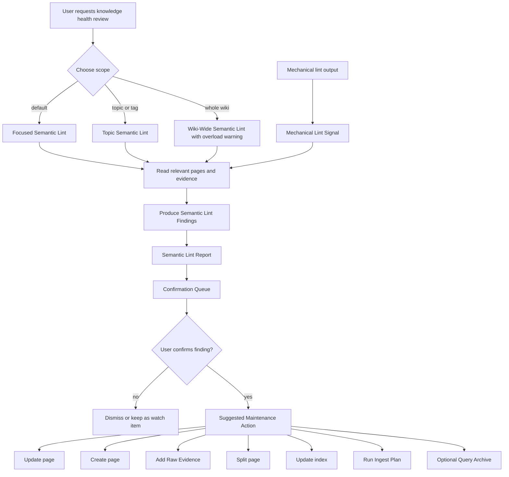

# feat: Add Semantic Lint workflow

## Summary

Add Semantic Lint as an LLM-assisted knowledge health review workflow for the wiki. The work should define structured semantic findings, report shape, scope choices, and confirmation rules while keeping mechanical `lint.py` checks separate from semantic judgment.

---

## Problem Frame

`lint.py` already checks mechanical wiki health: frontmatter shape, broken links, raw hashes, tag taxonomy, stale pages, log and topic-map consistency, and other deterministic signals. `SKILL.md` still describes contradictions, missing pages, stale claims, and similar knowledge-quality issues as manual deep checks. That gap makes the most important review mode underspecified: agents can notice semantic issues, but there is no canonical format for surfacing them as reviewable, non-automatic findings.

Semantic Lint should close that gap without pretending semantic judgment is a deterministic lint rule. V1 should help a human decide what to confirm, update, split, create, or archive; it should not auto-fix pages or introduce exit-code semantics.

---

## Requirements

**Workflow Boundary**

- R1. Semantic Lint must be defined as an LLM-assisted knowledge health review that complements mechanical lint.
- R2. V1 must not add a `semantic_lint.py` script, a `lint.py --semantic` mode, or semantic exit-code behavior.
- R3. Mechanical lint output may be used as Mechanical Lint Signal, but it must not be treated as a semantic conclusion.
- R4. Semantic Lint must produce findings for confirmation rather than directly modifying wiki pages.
- R5. Semantic Lint Reports must be ephemeral by default and shown in chat unless the user explicitly asks to save or archive a reusable analysis.

**Finding Model**

- R6. V1 must define the finding taxonomy: Contradiction Candidate, Missing Page Candidate, Stale Claim Candidate, Weak Evidence Candidate, Index Summary Drift, and Overgrown Page Candidate.
- R7. Every Semantic Lint Finding must include `type`, `title`, `affected_pages`, `evidence`, `confidence`, `severity`, `recommended_action`, `rationale`, and `confirmation_question`.
- R8. Confidence and severity must be documented as separate judgments.
- R9. Stale Page must be distinguished from Stale Claim Candidate: a stale page is mechanical age signal, while a stale claim is a semantic review candidate.

**Report and Scope**

- R10. The report shape must include Summary, High Severity Findings, Medium / Low Severity Findings, Confirmation Queue, Suggested Maintenance Actions, and optional Machine Data.
- R11. Supported scopes must be Focused Semantic Lint, Topic Semantic Lint, and Wiki-Wide Semantic Lint.
- R12. Focused Semantic Lint must be the default scope because single-page or recent-change review is easiest for humans to confirm.
- R13. Wiki-Wide Semantic Lint must warn about review overload and should be reserved for small wikis or explicit user requests.

**Maintenance Routing and Discoverability**

- R14. Suggested Maintenance Actions must route to existing wiki workflows such as updating a page, creating a page, adding Raw Evidence, splitting a page, updating `index.md`, running an Ingest Plan, or archiving reusable analysis as Query Archive.
- R15. Semantic Lint must not auto-create Query Archives; Query Archive is only one possible follow-up path for reusable Semantic Lint analysis.
- R16. `SKILL.md` must gain an independent Semantic Lint section and demote the old manual deep-check list into the new taxonomy and report workflow.
- R17. Seeded `templates/SCHEMA.md` must include a short Semantic Lint convention for new wikis.
- R18. README files must expose Semantic Lint as a knowledge health review capability without claiming full automation.
- R19. If prepared for merge or release, package and plugin metadata must bump from `1.2.0` to `1.3.0`.

---

## Scope Boundaries

### In Scope

- Update `CONTEXT.md` glossary terms for Semantic Lint and related concepts.
- Add a dedicated workflow reference at `skills/llm-wiki-toolchain/references/semantic-lint-workflow.md`.
- Update `skills/llm-wiki-toolchain/SKILL.md` with an independent Semantic Lint section.
- Update `skills/llm-wiki-toolchain/templates/SCHEMA.md` with a short convention for knowledge health review.
- Update `README.md` and `docs/README.en.md` to mention the capability.
- Add documentation validation tests for workflow language and boundaries.
- Synchronize `package.json` and `.claude-plugin/plugin.json` versions if the work is merged or released.

### Deferred to Follow-Up Work

- A deterministic skeleton script that pre-fills candidate review scope from mechanical lint signals.
- Machine-readable JSON schema validation for Semantic Lint reports.
- Direct integration with Query Archive export for reusable reports.
- Automated extraction of contradiction candidates or stale claim candidates.

### Out of Scope

- Adding `semantic_lint.py`.
- Adding `--semantic`, `semantic`, or similar semantic-check modes to `lint.py`.
- Turning semantic findings into CI failures.
- Automatically modifying wiki pages from Semantic Lint output.
- Saving Semantic Lint Reports into the wiki by default.
- Creating full runtime semantic tests that depend on LLM output.

---

## Key Technical Decisions

- KTD1. **Keep Semantic Lint separate from mechanical lint:** `lint.py` remains deterministic and machine-checkable; Semantic Lint remains review-oriented and confidence-bearing.
- KTD2. **Use documentation- and template-led V1:** The main value is shared judgment vocabulary and report structure, so a script would add premature ceremony without making semantic conclusions reliable.
- KTD3. **Model findings as confirmation candidates:** Findings should make uncertainty visible through evidence, confidence, severity, rationale, and a confirmation question.
- KTD4. **Treat Mechanical Lint Signal as input evidence:** Stale pages, oversized pages, broken links, and metadata gaps can guide review, but an agent must still inspect content before producing a Semantic Lint Finding.
- KTD5. **Keep reports ephemeral by default:** Ordinary semantic review belongs in chat, while confirmed work moves through normal wiki maintenance workflows.
- KTD6. **Use Query Archive only for reusable analysis:** A Semantic Lint Report can feed Query Archive when the analysis itself is likely to be reused, but ordinary findings should not become query pages.
- KTD7. **Bump minor version for release:** Semantic Lint is a user-visible workflow capability, so release metadata should move to `1.3.0` when merged.

---

## High-Level Technical Design

---

## Implementation Units

### U1. Canonicalize Semantic Lint workflow instructions

- **Goal:** Define Semantic Lint as a first-class workflow in the agent skill while preserving the boundary with deterministic lint.
- **Requirements:** R1, R2, R3, R4, R6, R7, R8, R9, R10, R11, R12, R13, R16
- **Dependencies:** None
- **Files:**
  - `CONTEXT.md`
  - `skills/llm-wiki-toolchain/SKILL.md`
  - `skills/llm-wiki-toolchain/references/semantic-lint-workflow.md`
  - `tests/test_semantic_lint_docs.py`
- **Approach:** Keep `SKILL.md` as the daily entry point and move detailed taxonomy, finding shape, report shape, and scope guidance into a new reference document. Replace the old manual deep-check framing with Semantic Lint language so agents produce structured findings instead of freeform warnings.
- **Patterns to follow:** `skills/llm-wiki-toolchain/references/ingest-plan-workflow.md` and `skills/llm-wiki-toolchain/references/query-archive-workflow.md` for reference-doc placement, boundary language, and workflow vocabulary.
- **Test scenarios:**
  - Given `SKILL.md`, when searched for Semantic Lint, it contains an independent section rather than only a bullet under health checks.
  - Given the reference doc, when searched for finding taxonomy, it lists all six V1 finding types.
  - Given the reference doc, when searched for finding fields, it includes all required fields from R7.
  - Given the reference doc, when searched for confidence and severity, it states that they are separate judgments.
  - Given `SKILL.md`, when searched for stale wording, it distinguishes Stale Page from Stale Claim Candidate.
- **Verification:** A reader can run a focused semantic review from the skill instructions and produce a consistent report without inventing the finding schema.

### U2. Document report shape, scope selection, and no-auto-fix rules

- **Goal:** Make Semantic Lint output predictable and safe for human confirmation.
- **Requirements:** R4, R5, R10, R11, R12, R13, R14, R15
- **Dependencies:** U1
- **Files:**
  - `skills/llm-wiki-toolchain/references/semantic-lint-workflow.md`
  - `skills/llm-wiki-toolchain/SKILL.md`
  - `tests/test_semantic_lint_docs.py`
- **Approach:** Add a report template with Summary, severity-grouped findings, Confirmation Queue, Suggested Maintenance Actions, and optional Machine Data. State that reports are chat-first and that maintenance actions require user confirmation before any wiki write.
- **Patterns to follow:** Query Archive's confirmation-first wording, but keep Semantic Lint lighter because it is a review report rather than a wiki artifact.
- **Test scenarios:**
  - Given the reference doc, when searched for report sections, it includes Summary, High Severity Findings, Medium / Low Severity Findings, Confirmation Queue, Suggested Maintenance Actions, and Machine Data.
  - Given the reference doc, when searched for no-auto-fix language, it states findings do not modify pages automatically.
  - Given the reference doc, when searched for scopes, it defines Focused, Topic, and Wiki-Wide Semantic Lint.
  - Given the reference doc, when searched for wiki-wide behavior, it warns about overload.
  - Given the reference doc, when searched for Query Archive, it frames archive as optional follow-up for reusable analysis rather than the default output.
- **Verification:** The report contract gives reviewers the right questions to answer before any maintenance work begins.

### U3. Add seeded schema conventions for new wikis

- **Goal:** Ensure newly initialized wikis inherit the distinction between mechanical health checks and semantic health review.
- **Requirements:** R1, R3, R4, R9, R17
- **Dependencies:** U1, U2
- **Files:**
  - `skills/llm-wiki-toolchain/templates/SCHEMA.md`
  - `tests/test_semantic_lint_docs.py`
- **Approach:** Add a compact Semantic Lint convention to SCHEMA that defines the workflow boundary, finding types, confirmation requirement, and the Stale Page versus Stale Claim Candidate distinction. Keep this short so SCHEMA remains a wiki convention document rather than a full workflow manual.
- **Patterns to follow:** Existing SCHEMA sections give durable rules and point agents toward workflow-specific docs rather than duplicating all details.
- **Test scenarios:**
  - Given `templates/SCHEMA.md`, when searched for Semantic Lint, it describes it as knowledge health review.
  - Given `templates/SCHEMA.md`, when searched for mechanical lint, it distinguishes mechanical signals from semantic findings.
  - Given `templates/SCHEMA.md`, when searched for Stale Claim Candidate, it distinguishes the term from Stale Page.
  - Given `templates/SCHEMA.md`, when searched for confirmation, it says Semantic Lint findings require confirmation before maintenance writes.
- **Verification:** A freshly scaffolded wiki carries enough convention for agents to avoid treating semantic review as CI lint.

### U4. Expose Semantic Lint in project documentation

- **Goal:** Make the new workflow discoverable without overselling it as fully automated linting.
- **Requirements:** R1, R2, R18
- **Dependencies:** U1, U2, U3
- **Files:**
  - `README.md`
  - `docs/README.en.md`
  - `tests/test_semantic_lint_docs.py`
- **Approach:** Add Semantic Lint to the capability descriptions using "知识健康审查" in Chinese and "knowledge health review" in English. The README should say it outputs structured confirmation items, not deterministic errors or automatic fixes.
- **Patterns to follow:** README entries for Ingest Plan and Query Archive: concise capability language in README, full workflow details in `SKILL.md` and references.
- **Test scenarios:**
  - Given `README.md`, when searched for Semantic Lint or 语义检查, it describes knowledge health review and structured confirmation items.
  - Given `docs/README.en.md`, when searched for Semantic Lint, it describes LLM-assisted knowledge health review.
  - Given both README files, when searched for automation claims, they do not imply that Semantic Lint is a full automatic checker.
- **Verification:** A user scanning the project overview can discover Semantic Lint and understand its human-in-the-loop boundary.

### U5. Add documentation validation and release metadata

- **Goal:** Protect the new workflow language from drifting across docs and keep release metadata synchronized.
- **Requirements:** R2, R6, R7, R10, R16, R17, R18, R19
- **Dependencies:** U1, U2, U3, U4
- **Files:**
  - `tests/test_semantic_lint_docs.py`
  - `package.json`
  - `.claude-plugin/plugin.json`
  - `skills/llm-wiki-toolchain/scripts/lint.py`
- **Approach:** Add dependency-free `unittest` checks that read docs as text and assert the workflow contract. Include a guard that `lint.py` has not gained semantic CLI behavior. If preparing the work for merge, bump both version fields to `1.3.0`.
- **Patterns to follow:** Existing docs tests use lightweight text assertions for workflow invariants and version parity.
- **Test scenarios:**
  - Given the documentation validation suite, when run through `npm test`, it passes without network or LLM dependencies.
  - Given package and plugin metadata, when versions are read, both fields match `1.3.0`.
  - Given `skills/llm-wiki-toolchain/scripts/lint.py`, when searched for semantic CLI modes, it does not define `--semantic` or a semantic lint check set.
  - Given modified docs, when `git diff --check` runs, no whitespace errors are reported.
- **Verification:** The feature remains a documented workflow with clear boundaries, and release metadata does not drift.

---

## Acceptance Examples

- AE1. Given a user asks for a Semantic Lint of one recently updated page, when the agent reviews it, then the agent returns a chat report with findings, evidence, confidence, severity, and confirmation questions without writing to the wiki.
- AE2. Given mechanical lint reports stale pages, when the agent performs Semantic Lint, then stale pages are treated as review prompts and only become Stale Claim Candidates after content evidence supports that conclusion.
- AE3. Given a topic has multiple related pages and index summaries, when the user requests Topic Semantic Lint, then the report can include Contradiction Candidate, Missing Page Candidate, Weak Evidence Candidate, and Index Summary Drift findings in the same structure.
- AE4. Given a user asks for Wiki-Wide Semantic Lint on a large wiki, when the agent starts the review, then the workflow warns about overload and suggests narrowing to Focused or Topic scope unless the user explicitly continues.
- AE5. Given a Semantic Lint finding recommends splitting an overgrown page, when the user confirms it, then the follow-up work is routed as normal wiki maintenance rather than auto-applied by Semantic Lint.
- AE6. Given a Semantic Lint report contains a reusable analysis of a recurring question, when the user asks to preserve it, then the agent may route it through Query Archive; ordinary findings are not archived by default.

---

## Risks and Dependencies

- **Automation confusion:** Users or agents may expect Semantic Lint to behave like `lint.py`. Mitigation: repeat the no-script, no-exit-code boundary in `SKILL.md`, the reference doc, SCHEMA, README, and tests.
- **Overloaded reports:** Wiki-wide review can overwhelm human confirmation. Mitigation: make Focused Semantic Lint the default and require overload warning for wiki-wide scope.
- **Overconfident findings:** LLM-authored semantic issues can be wrong. Mitigation: require evidence, confidence, severity, rationale, and confirmation questions for every finding.
- **Workflow sprawl:** Suggested Maintenance Actions could duplicate other workflows. Mitigation: route confirmed findings into existing update, create, evidence, split, index, Ingest Plan, and Query Archive workflows.
- **Documentation drift:** The taxonomy could diverge across `CONTEXT.md`, `SKILL.md`, reference docs, SCHEMA, and README. Mitigation: add targeted text validation tests.

---

## Sources

- `CONTEXT.md` for canonical Semantic Lint vocabulary and boundary terms.
- `skills/llm-wiki-toolchain/SKILL.md` for current health-check workflow and manual deep-check language.
- `skills/llm-wiki-toolchain/scripts/lint.py` for existing deterministic mechanical lint scope.
- `skills/llm-wiki-toolchain/references/ingest-plan-workflow.md` for documentation-led workflow precedent.
- `skills/llm-wiki-toolchain/references/query-archive-workflow.md` for confirmation-first workflow precedent.
- `docs/plans/2026-06-11-002-feat-query-archive-workflow-plan.md` for plan structure and release hygiene pattern.
