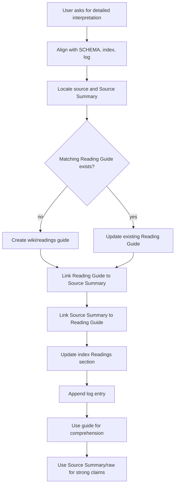

# feat: Add Reading Guide workflow

## Summary

Add Reading Guide as a first-class wiki workflow for papers, long articles, and reports. The implementation should seed `wiki/readings/`, add a Reading Guide template, update Source Summary/index/log conventions, teach the skill when to create or update guides, and protect the evidence boundary between explanatory reading notes and source-backed wiki claims.

---

## Problem Frame

The current Source Summary flow makes sources searchable and traceable, but it compresses a source into metadata, key points, entities, concepts, and raw evidence. That shape is useful for wiki maintenance and less useful when the user asks for a detailed explanation that helps them follow the argument of a paper or report.

The brainstorm defined Reading Guide as the missing artifact: a narrative, saved page under `wiki/readings/` that explains a long-form source in human reading order. It coexists with Source Summary instead of replacing it, and it must not blur the boundary between original evidence in `raw/` and agent-authored interpretation.

---

## Requirements

**Page Type and Storage**

- R1. New wiki initialization must create `wiki/readings/`.
- R2. Seeded schema and skill instructions must define `wiki/readings/` as the home for Reading Guide pages.
- R3. `raw/` must remain reserved for original sources and derived source text, not agent-authored explanation.
- R4. Reading Guide V1 must support papers, long articles, and reports.
- R5. Reading Guide filenames must default to `<source title> - Reading Guide.md`.

**Relationship to Existing Pages**

- R6. Reading Guides must coexist with Source Summary pages rather than replacing them.
- R7. Reading Guide template and workflow must link to Source Summary when one exists.
- R8. Source Summary template and conventions must link to Reading Guide when one exists.
- R9. Reading Guides must be indexed by default in a dedicated Readings section.
- R10. `log.md` must document Reading Guide creation and material updates.

**Creation and Update Behavior**

- R11. The skill must create or update a Reading Guide only when the user explicitly asks for detailed interpretation, close reading, or help understanding a source.
- R12. Ordinary ingest must not automatically create Reading Guides.
- R13. Existing guide matching must be conservative: same raw hash, same source URL, explicit Source Summary link, or explicit alias.
- R14. When a matching Reading Guide exists, default behavior must update the existing guide instead of creating a duplicate.

**Reading Experience**

- R15. The Reading Guide template must be narrative and explanatory, not a dense fact-card clone of Source Summary.
- R16. The template must cover problem, motivation, core idea, method or system, key results, trade-offs, limitations, relationship to existing wiki knowledge, and takeaway.
- R17. The workflow must allow source-specific headings rather than forcing every source into the same section order.

**Evidence and Trust**

- R18. Reading Guides must not require paragraph-level provenance in V1.
- R19. Strong claims, numeric details, paper conclusions, disputed judgments, and corrections must route readers back to Source Summary or raw evidence.
- R20. Reading Guides must not be treated as the primary evidence source for stable entity, concept, or topic claims.

**Release and Validation**

- R21. Documentation tests must verify the workflow boundary, template fields, seeded directory structure, index/log conventions, and README discovery text.
- R22. If prepared for merge or release, package and plugin metadata must bump from `1.3.0` to `1.4.0`.

---

## Scope Boundaries

### In Scope

- Add Reading Guide workflow language to `SKILL.md`.
- Add a dedicated Reading Guide reference document.
- Add `wiki/readings/` to initialization and seeded schema.
- Add `templates/page-templates/reading-guide.md`.
- Update Source Summary template and page-template docs to link guides and summaries.
- Update `templates/index.md` and `templates/log.md` with Readings conventions.
- Update README discovery text.
- Add documentation and init validation tests.
- Synchronize package/plugin versions when the work is merged or released.

### Deferred to Follow-Up Work

- A generator script for Reading Guides.
- Strict paragraph-level provenance inside Reading Guides.
- Automatic Reading Guide creation during all paper ingest.
- Multiple dated Reading Guides for the same source.
- Applying Reading Guides to short notes, code sources, podcasts, or videos.
- Migrating existing Source Summary pages or time-based notes into Reading Guides.

### Out of Scope

- Moving agent-authored explanation into `raw/`.
- Replacing Source Summary with Reading Guide.
- Treating Reading Guide as the primary evidence source for stable wiki claims.
- Reworking all existing source summary pages during V1.

---

## Key Technical Decisions

- KTD1. **Dedicated `wiki/readings/` page type:** Reading Guides need their own space because they are longer and more narrative than Source Summaries, but still wiki-authored knowledge rather than raw evidence.
- KTD2. **Template-led V1:** The workflow depends on semantic reading and prose judgment, so V1 should define instructions and templates rather than add a low-value generator script.
- KTD3. **Source Summary remains the evidence anchor:** Reading Guides can help users understand an argument, but stable claims should still point to Source Summary and raw evidence.
- KTD4. **Conservative update matching:** Same raw hash, same source URL, explicit Source Summary link, or explicit alias can update an existing guide; fuzzy title similarity requires confirmation.
- KTD5. **Index and log participation by default:** Reading Guides are first-class wiki pages, so they should enter a dedicated Readings index section and log material creation or update events.
- KTD6. **Minor release bump:** Reading Guide is a new user-facing workflow and seeded page type, so release metadata should move to `1.4.0` when merged.

---

## High-Level Technical Design



---

## Output Structure

```text
skills/llm-wiki-toolchain/
├── references/
│   └── reading-guide-workflow.md
├── templates/
│   ├── page-templates/
│   │   └── reading-guide.md
│   ├── SCHEMA.md
│   ├── index.md
│   └── log.md
└── scripts/
    └── init.py
tests/
└── test_reading_guide_docs.py
```

---

## Implementation Units

### U1. Define Reading Guide vocabulary and workflow

- **Goal:** Teach the skill that detailed-reading prompts create or update Reading Guides, while ordinary ingest does not.
- **Requirements:** R2, R3, R4, R5, R6, R11, R12, R13, R14, R18, R19, R20
- **Dependencies:** None
- **Files:**
  - `CONTEXT.md`
  - `skills/llm-wiki-toolchain/SKILL.md`
  - `skills/llm-wiki-toolchain/references/reading-guide-workflow.md`
  - `tests/test_reading_guide_docs.py`
- **Approach:** Add canonical terms such as Reading Guide, Reading Guide Match, Source Summary Link, and Readings Index Entry to `CONTEXT.md`. Add a concise `SKILL.md` workflow section for explicit detailed-reading triggers, update-in-place behavior, evidence boundaries, and Source Summary coexistence. Put full details in a new reference document, following the pattern used by Ingest Plan, Query Archive, and Semantic Lint.
- **Patterns to follow:** `skills/llm-wiki-toolchain/references/query-archive-workflow.md` for confirmation/update boundaries; `skills/llm-wiki-toolchain/references/semantic-lint-workflow.md` for no-script V1 boundary language.
- **Test scenarios:**
  - Given `SKILL.md`, when searched for Reading Guide, it describes `wiki/readings/` as the default destination.
  - Given `SKILL.md`, when searched for ingest behavior, it states ordinary ingest does not automatically create Reading Guides.
  - Given the reference doc, when searched for matching behavior, it lists raw hash, source URL, Source Summary link, and alias as conservative matches.
  - Given the reference doc, when searched for evidence behavior, it says strong claims route back to Source Summary or raw evidence.
- **Verification:** A user asking for detailed interpretation can tell when the agent should create a Reading Guide, when it should update one, and what evidence boundary it must preserve.

### U2. Seed `wiki/readings/` and page conventions

- **Goal:** Make new wikis create and document the Readings page type.
- **Requirements:** R1, R2, R3, R4, R5, R6, R7, R8, R18, R19, R20
- **Dependencies:** U1
- **Files:**
  - `skills/llm-wiki-toolchain/scripts/init.py`
  - `skills/llm-wiki-toolchain/templates/SCHEMA.md`
  - `skills/llm-wiki-toolchain/templates/page-templates/reading-guide.md`
  - `skills/llm-wiki-toolchain/templates/page-templates/source-summary.md`
  - `tests/test_reading_guide_docs.py`
- **Approach:** Add `wiki/readings` to the initialized directory list and user-facing init output. Extend SCHEMA with Reading Guide conventions. Add a page template with frontmatter for source identity, Source Summary link, raw path/hash, status, confidence, and indexed state. Add an optional Reading Guide link section to Source Summary so the two pages can point to each other.
- **Patterns to follow:** Existing page templates keep frontmatter compact and use comments to explain conditional sections. Keep Reading Guide prose scaffolding flexible enough for source-specific headings.
- **Test scenarios:**
  - Given a new initialized wiki, when inspected, it contains `wiki/readings/`.
  - Given `SCHEMA.md`, when searched for Reading Guide, it defines `wiki/readings/` and says raw remains source-only.
  - Given `reading-guide.md`, when searched for frontmatter, it includes source title, source type, source URL, raw path or hash, Source Summary link, status, confidence, and indexed state.
  - Given `source-summary.md`, when searched for Reading Guide, it includes an optional link back to the guide.
- **Verification:** New wiki scaffolds include the directory and conventions needed to create Reading Guides without ad hoc paths.

### U3. Add index, log, and README discoverability

- **Goal:** Make Reading Guides visible as first-class wiki pages without mixing them into Topics.
- **Requirements:** R8, R9, R10, R15, R16, R17
- **Dependencies:** U1, U2
- **Files:**
  - `skills/llm-wiki-toolchain/templates/index.md`
  - `skills/llm-wiki-toolchain/templates/log.md`
  - `README.md`
  - `docs/README.en.md`
  - `tests/test_reading_guide_docs.py`
- **Approach:** Add a Readings section to the seeded index template with a comment format that emphasizes source title, source type, and Source Summary link. Add a log example for reading guide creation or update. Update README capability text and quick-start prompts to mention detailed interpretation saved as Reading Guide.
- **Patterns to follow:** Query Archive index/log conventions use comments and examples rather than generated entries; README should stay high-level and point to `SKILL.md` for full workflow behavior.
- **Test scenarios:**
  - Given `templates/index.md`, when searched for Readings, it defines a dedicated section.
  - Given `templates/log.md`, when searched for reading entries, it includes a reading guide creation/update example.
  - Given `README.md`, when searched for Reading Guide, it describes detailed interpretation saved under `wiki/readings/`.
  - Given `docs/README.en.md`, when searched for Reading Guide, it describes the English capability without implying automatic generation on every ingest.
- **Verification:** Users can discover Reading Guides from README and initialized wikis can index/log them consistently.

### U4. Add validation coverage and release metadata

- **Goal:** Protect the workflow from drift across instructions, templates, initialization, docs, and version metadata.
- **Requirements:** R1-R22
- **Dependencies:** U1, U2, U3
- **Files:**
  - `tests/test_reading_guide_docs.py`
  - `package.json`
  - `.claude-plugin/plugin.json`
- **Approach:** Add dependency-free `unittest` checks that read docs/templates as text and exercise `init.py` enough to verify the new directory is created. Synchronize package/plugin versions to `1.4.0` if the work is prepared for merge.
- **Patterns to follow:** `tests/test_query_archive_docs.py` and `tests/test_semantic_lint_docs.py` for text-level workflow assertions; `tests/test_ingest_plan.py` for temporary-directory init-style coverage.
- **Test scenarios:**
  - Given the test suite, when run through the existing npm test script, all tests pass without network or LLM dependencies.
  - Given package and plugin metadata, when versions are read, both fields match `1.4.0`.
  - Given Reading Guide docs and templates, when searched by tests, they preserve destination, trigger, update matching, index/log, and evidence-boundary language.
  - Given modified docs, when whitespace checks run, there are no trailing whitespace errors.
- **Verification:** The feature remains a documented, seeded workflow and release metadata does not drift.

---

## Acceptance Examples

- AE1. Given a source already has a Source Summary, when the user asks for a detailed interpretation, then the agent creates `wiki/readings/<source title> - Reading Guide.md` and links it to the Source Summary.
- AE2. Given a normal ingest request without detailed-reading language, when the agent ingests a paper, then it does not automatically create a Reading Guide.
- AE3. Given a Reading Guide already exists for the same raw hash or source URL, when the user asks for another detailed interpretation, then the agent updates the existing guide by default.
- AE4. Given a Reading Guide includes a numeric benchmark or strong conclusion, when a reader needs evidence, then the guide points back to Source Summary or raw evidence rather than standing alone as proof.
- AE5. Given the wiki index is updated after guide creation, when the user scans `index.md`, then the guide appears under a Readings section rather than Topics.

---

## Risks and Dependencies

- **Guide bloat:** Narrative pages can become long and inconsistent. Mitigation: the template should provide stable waypoints while allowing source-specific headings.
- **Evidence boundary drift:** Agents may cite Reading Guides as proof. Mitigation: repeat the Source Summary/raw evidence boundary in SKILL, SCHEMA, template comments, and tests.
- **Duplicate guides:** Similar source titles may create multiple guides. Mitigation: conservative matching uses raw hash, source URL, Source Summary link, and alias; fuzzy matches require confirmation.
- **Index clutter:** Readings can grow quickly. Mitigation: keep them in a dedicated index section and avoid automatic creation during ordinary ingest.
- **Version drift:** Package and plugin metadata must remain synchronized when the feature ships. Mitigation: include version parity in validation tests.

---

## Sources

- `docs/brainstorms/2026-06-11-reading-guide-requirements.md` for product scope and acceptance examples.
- `skills/llm-wiki-toolchain/SKILL.md` for current ingest, query, page-template, and evidence-boundary instructions.
- `skills/llm-wiki-toolchain/scripts/init.py` for seeded directory creation.
- `skills/llm-wiki-toolchain/templates/SCHEMA.md` for wiki page conventions.
- `skills/llm-wiki-toolchain/templates/page-templates/source-summary.md` for Source Summary structure.
- `skills/llm-wiki-toolchain/templates/index.md` and `skills/llm-wiki-toolchain/templates/log.md` for discoverability and lifecycle conventions.
- `tests/test_query_archive_docs.py` and `tests/test_semantic_lint_docs.py` for documentation validation patterns.
